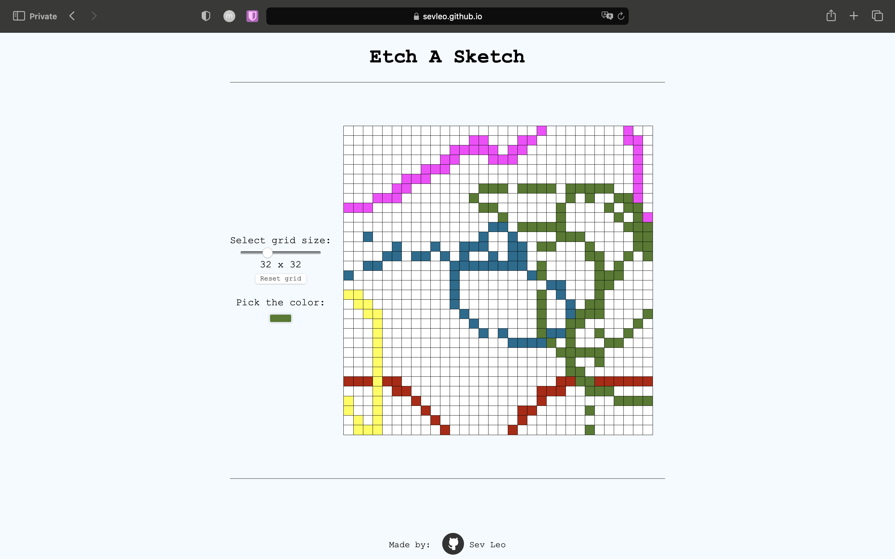

# Etch-a-Sketch

The project provides a canvas with a grid for drawing stuff.

## Table of Contents

- [Demo](#demo)
- [How to use](#how-to-use)
- [Technologies used](#technologies)
- [Contributing](#contributing)
- [License](#license)

## Demo

You can view the project at [Etch-a-Sketch Demo](https://sevleo.github.io/Etch-a-Sketch/).

## How to use
Select the color and hover over the grid layout. The cells you hover will change the color to that which you have selected.

Default size of the grid is 16x16, but you can change that to any range between 1x1 and 100x100.

## Technologies

- Vanilla JS
- CSS
- HTML

## Contributing

 Contributions are welcome! If you'd like to contribute to this project, please follow these guidelines:

 1. Fork the repository.
 2. Create a new branch for your feature or bug fix.
 3. Make your changes and commit them.
 4. Push your changes to your fork.
 5. Create a pull request.

## License

 This project is licensed under the [MIT LICENSE](./LICENSE)